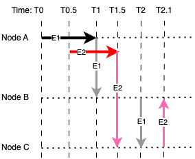

# Architecture

This section discusses the architecture of Hedera.

## Key Features

1. **Hashgraph Consensus**
    * **Gossip Protocol**: Nodes communicate by sharing transaction information with random neighbouring nodes. This “gossip about gossip” creates a record of communication history.
    * **Virtual Voting**: Nodes reach consensus by analysing the shared information, eliminating the need for extensive communication or energy-intensive mining.

2. **Governance Model**: Hedera is governed by a Council of 39 global organisations, including enterprises like Google, IBM, and Tata Communications. These members rotate and ensure decentralised decision-making.

3. **Node Network**:
    * **Public Nodes**: Ensure open participation in the network.
    * **Council Nodes**: Managed by council members to maintain the network’s security and stability. Over time, the network aims to expand decentralisation by increasing public node participation.

4. **Token Service (HTS)**: Allows users to issue, transfer, and manage native fungible and non-fungible tokens directly on Hedera without smart contracts, making transactions more efficient and cost-effective.

5. **Smart Contracts**: Hedera supports Solidity-based smart contracts, executed in the Ethereum Virtual Machine (EVM) environment.

6. **Consensus Service (HCS)**: Enables the logging of messages or events to the ledger with timestamps and consensus, ideal for tracking and auditing.

7. **Hedera File Service**: Provides decentralised storage for small files or data, linked to the ledger for transparency and security.

8. **Cryptographic Security**: Utilises asynchronous Byzantine Fault Tolerance (aBFT), ensuring high security against malicious actors while maintaining performance.

9. **Hedera Token (HBAR)**: HBAR is used for:
    * Transaction fees.
    * Network services like smart contract execution and file storage.
    * Staking to ensure network security.

## Hedera (Hashgraph) vs Blockchain

| Feature               | Blockchain-Based Solution           | Hedera (Hashgraph)               |
|-----------------------|--------------------------------------|-----------------------------------|
| **Consensus Mechanism** | Proof of Work (PoW), Proof of Stake (PoS) | Hashgraph with Gossip & Virtual Voting |
| **Transaction Structure** | Sequential blocks                  | Directed Acyclic Graph (DAG)     |
| **Finality**           | Probabilistic (requires confirmations) | Instant (asynchronous BFT)       |
| **Throughput**         | Limited (e.g., Ethereum ~30 TPS)    | High (10,000+ TPS)               |
| **Governance**         | Decentralised among miners/stakers  | Council of 39 global organisations |
| **Fairness**           | Potential miner/staker bias         | Timestamp-based ordering         |
| **Energy Efficiency**  | High (PoW systems are energy-intensive) | Low (no mining required)         |
| **Scalability**        | Limited by block size and intervals | Highly scalable via DAG structure |
| **Security**           | Varies by protocol (e.g., 51% attack risk) | Asynchronous BFT (aBFT)          |
| **Cost**               | Variable and often high             | Predictable and low              |

## Hedera Node

Hedera's network is composed of a network of nodes, and there two types:   

* **Consensus Nodes**: These are the core nodes responsible for running the Hashgraph consensus algorithm and maintaining the shared ledger. They are operated by members of the Hedera Governing Council, which are reputable organizations. These nodes are permissioned.   

* **Mirror Nodes**: These nodes maintain a read-only copy of the ledger. They don't participate in consensus but provide a way for developers and applications to access historical data and query the current state of the network. These nodes are permissionless and can be run by anyone.   

At a high level, a Hedera consensus node includes:   

* **Hashgraph Implementation**: The core logic for running the Hashgraph consensus algorithm. This includes handling events, gossiping information with other nodes, and determining transaction order.

* **Ledger Storage**: A database (or similar storage mechanism) to store the ledger data, including transactions, account balances, smart contract state, and other relevant information.

* **Networking Components**: Modules for communicating with other nodes in the network, including handling gossip protocols and transaction propagation.

* **API and Services**: Interfaces for clients and applications to interact with the node, submit transactions, and query data.

The equivalent of a State Machine in Hedera includes:

* **World State**: Hedera maintains a "world state," which is a representation of the current state of the ledger. This includes all accounts, their balances, smart contract state, file storage, and other relevant data.  

* **State Updates through Transactions**: As discussed before, transactions are the mechanism by which the world state is changed. When a transaction is processed and reaches consensus, it causes a transition from one world state to another.

* **State Storage**: This world state is stored and maintained by the consensus nodes. The Hashgraph algorithm ensures that all consensus nodes agree on the current world state.

## Hashgraph Consensus

Hedera operates on Hashgraph, achieves consensus through:

1.	**Gossip Protocol**:
    * Nodes randomly share transaction information with neighbouring nodes.
    * Each “gossip” includes both the transaction and metadata about the communication itself (called “gossip about gossip”).
    * This process ensures rapid and efficient propagation of information across the network.

2.	**Virtual Voting**:
    * Using the metadata shared during gossip, each node can independently calculate the consensus without direct voting.
    * Nodes determine the order and validity of transactions by analysing the shared 'gossip history.'

3.	**Asynchronous Byzantine Fault Tolerance (aBFT)**:
    * Guarantees that the system can reach consensus even if some nodes act maliciously.
    * Consensus is reached as soon as nodes have sufficient information, without waiting for blocks to be confirmed.

4.	**Transaction Finality**: Transactions achieve instant finality once consensus is reached. There is no need to wait for multiple confirmations as in many blockchain systems.

Here is an illustrative example of the working of Hedera consensus algorithm.

<figure>
  
  <figcaption>Figure 1 - An illustration of Hedera consensus mechanism.</figcaption>
</figure>

In the case of Figure 1, let's assume that there are three nodes.

At time T0, Node A issue a transaction (an event plus metadata - E1). At time T1, Node A gossip the E1 to Node B.
At T2, Node B gossip the E1 to Node C. This network reaches consensus for all nodes pertaining to E1.

At time T0.5, Node A issue another transaction (E2). E2 is also recorded in ledger as following E1. At time T1.5 Node 
A gossip E2 to Node C. At time T2.5 Node C gossip E2 to Node B. This network reaches consensus for all nodes pertaining
to E2.

All nodes independently perform the following tasks:
* The nodes acts as witness to the transactions (e.g. Node A, E1 and E2, etc)
* Check the order of transactions based on timestamp embedded in the meta data.

> NOTE: In practice, any nodes in the network can initiate transactions. Consensus
> is reach per transactions, when all nodes have verified each transactions. 
>
> This differ from blockchain where transactions are batched into blocks then chained
> and the chain of blocks is gossip to every other nodes.

## Hedera Account

Hedera maintains accounts in its ledger on the node, very much like Ethereum, but with some key differences in structure and usage.   

* **Explicitly Created**: Unlike Ethereum where accounts are implicitly created by sending Ether to an address, Hedera requires an explicit AccountCreateTransaction to create an account.

* **Account ID**: Each account is assigned a unique Account ID in the format `shard.realm.num` (e.g., 0.0.12345). This ID is the primary way to reference an account on the Hedera network.

* **Properties**: Hedera accounts have several properties stored on the ledger:
    * **Account Balance**: The amount of HBAR (Hedera's native cryptocurrency) held by the account.
    * **Public Key**: The public key associated with the account, used for authorizing transactions.   
    * **Other Properties**: Accounts can also have properties like:
        * `Key rotation`: The ability to update the public key associated with the account.
        * `Expiration time`: A time after which the account becomes inactive.
        * `Staking information`: For participating in network staking (if enabled).
        * `Contract association`: Linking the account to smart contracts.

Hedera vs Ethereum Accounts:

* **Account ID vs Address**: Ethereum uses addresses derived directly from public keys, while Hedera uses distinct Account IDs.

* **Explicit Creation**: Hedera requires explicit account creation transactions, while Ethereum accounts are created implicitly.

* **Additional Properties**: Hedera accounts have more built-in properties compared to basic Ethereum accounts.

Analogy

| Ethereum | Hedera |
| --- | --- |
|  Your bank account number is directly derived from your fingerprint (public key). Anyone with your fingerprint can easily figure out your account number.  |  Your bank account has a unique account number assigned by the bank. You provide a signature card (public key) to authorize transactions. You can later update your signature card (change your public key) without changing your account number. |

## Key Management

* `Ed25519` is generally the recommended key type for native Hedera operations like transfering HBAR.
* `ECDSA (secp256k1)` for operations with EVM contracts.

| Use Case | Key Type | Rationale |
| --- | --- | --- |
| Native Hedera Operations | Ed25519 | Recommended for most native Hedera operations, including:<ul><li>Creating accounts</li><li>Transferring HBAR</li><li>Updating account properties (e.g., key rotation)</li><li>File service operations</li><li>Consensus service operations</li></ul>Ed25519 offers better performance and security characteristics compared to ECDSA on Hedera for these use cases. |
| Interacting with EVM Smart Contracts | ECDSA (secp256k1) | Required for interacting with smart contracts deployed to Hedera's EVM. This is because the EVM expects transactions to be signed using ECDSA keys, maintaining compatibility with the Ethereum ecosystem. This includes:<ul><li>Deploying EVM contracts</li><li>Calling functions on EVM contracts</li><li>Sending transactions to EVM contracts</li></ul> |
| Multi-signature Accounts (General) | Ed25519 | Generally preferred for multi-signature accounts on Hedera for the same performance and security reasons as above. You can use Key Lists or Threshold Keys with Ed25519 keys. |
| Multi-signature Accounts (EVM Compatibility) | ECDSA (secp256k1) | If you need a multi-signature scheme that is also compatible with EVM contracts (e.g., a multi-sig wallet contract), you would need to use ECDSA keys. This is because the EVM's `ecrecover` precompile and other related functions operate on ECDSA signatures. However, it's important to note that implementing robust multi-sig directly in Solidity/EVM can be complex and gas-intensive. Often, it's better to manage multi-sig at the Hedera layer if EVM compatibility is not strictly required. |